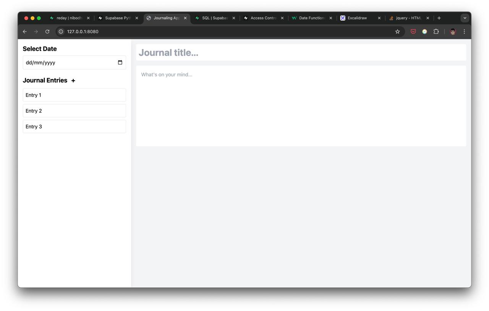
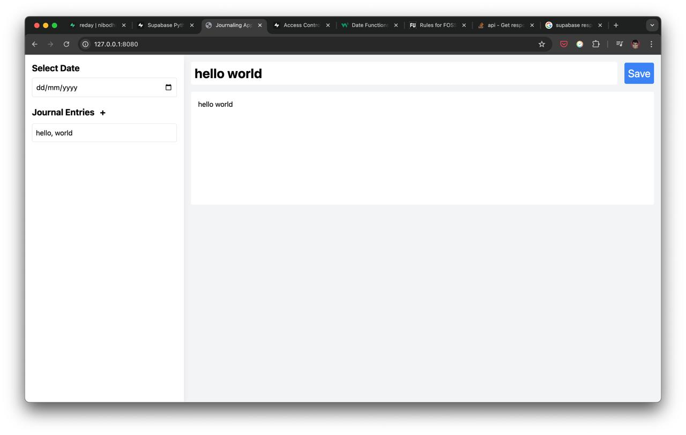

# reday

reday is a simple open source daily journal that you can self host and keep you daily journal entries private.

## Features

-   Simple and clean UI
-   Daily journal entries
-   Supabase database
-   Self hosted

## Installation

1. Clone the repository by running `git clone https://github.com/nibodhdaware/reday.git`
2. Create a virtual environment by running `python3 -m venv venv` (optional)
3. Install the dependencies by running `pip3 install -r requirements.txt`
4. Create project and a table in your Supabase database with the following schema:
    ```
    CREATE TABLE entries (
    	j_name varchar(255) PRIMARY KEY,
    	j_title varchar(255) NOT NULL,
    	j_date date NOT NULL,
    	j_content TEXT NOT NULL
    );
    ```
5. Create a `.env` file in the root directory and add the following variables:
    ```
    SUPABASE_URL=<supabase_url>
    SUPABASE_KEY=<supabase_key>
    ```
    You can get the `SUPABASE_URL` and `SUPABASE_KEY` by creating a project on [Supabase](https://supabase.com/)
6. Run the app by running `python3 app.py`
7. Visit `http://localhost:8080` or `127.0.0.1:8080` in your browser

## Screenshots




## License

MIT License

Copyright (c) [year] [fullname]

Permission is hereby granted, free of charge, to any person obtaining a copy
of this software and associated documentation files (the "Software"), to deal
in the Software without restriction, including without limitation the rights
to use, copy, modify, merge, publish, distribute, sublicense, and/or sell
copies of the Software, and to permit persons to whom the Software is
furnished to do so, subject to the following conditions:

The above copyright notice and this permission notice shall be included in all
copies or substantial portions of the Software.

THE SOFTWARE IS PROVIDED "AS IS", WITHOUT WARRANTY OF ANY KIND, EXPRESS OR
IMPLIED, INCLUDING BUT NOT LIMITED TO THE WARRANTIES OF MERCHANTABILITY,
FITNESS FOR A PARTICULAR PURPOSE AND NONINFRINGEMENT. IN NO EVENT SHALL THE
AUTHORS OR COPYRIGHT HOLDERS BE LIABLE FOR ANY CLAIM, DAMAGES OR OTHER
LIABILITY, WHETHER IN AN ACTION OF CONTRACT, TORT OR OTHERWISE, ARISING FROM,
OUT OF OR IN CONNECTION WITH THE SOFTWARE OR THE USE OR OTHER DEALINGS IN THE
SOFTWARE.
